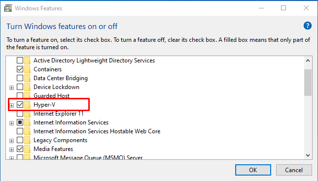
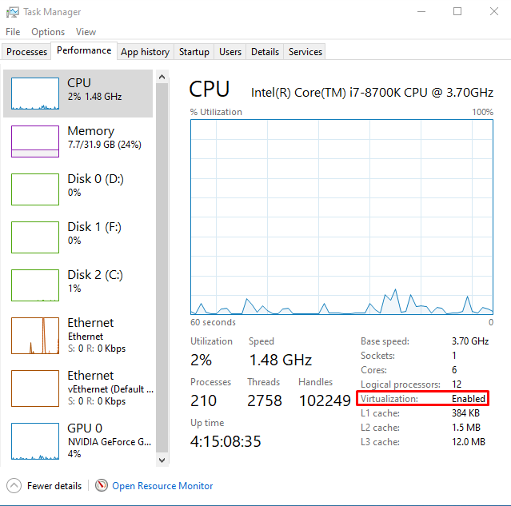
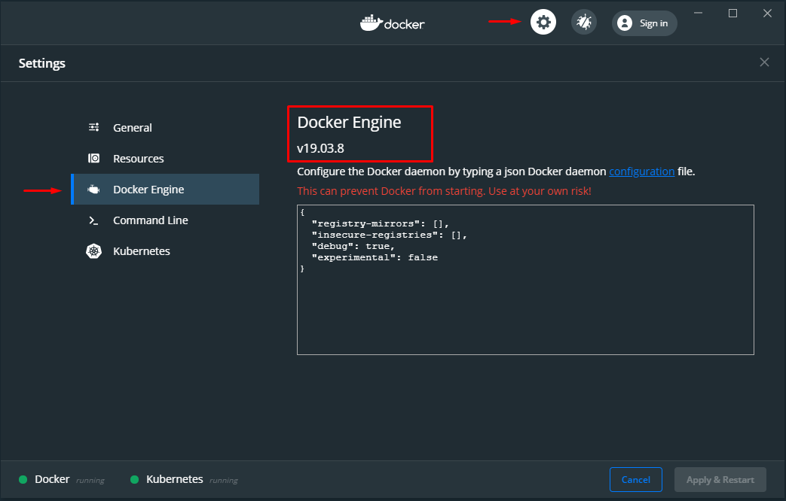
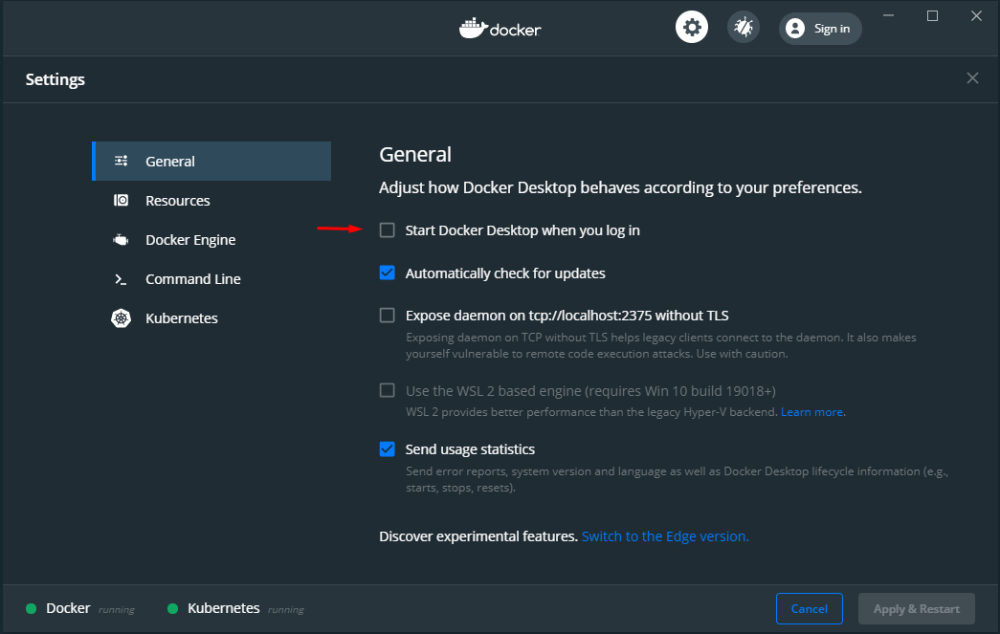

# Docker installation guide

You can download Docker Desktop from ["Get Docker"](https://docs.docker.com/get-docker/) webpage.

    
System requiremetns for Windows

    - Windows 10 64-bit: Pro, Enterprise, or Education (Build 15063 or later)
    - Hyper-V and Containers must be enabled in Windows features.
    - BIOS-level hardware virtualization support must be enabled in the BIOS settings
    - 4GB system RAM
    - 64 bit processor

    
System requiremetns for OSX

    - Mac hardware must be a 2010 or a newer model, with Intel’s hardware support for memory management unit (MMU) virtualization, including Extended Page Tables (EPT) and Unrestricted Mode. You can check to see if your machine has this support by running the following command in a terminal: sysctl kern.hv_support. If your Mac supports the Hypervisor framework, the command prints kern.hv_support: 1
    - macOS must be version 10.13 or newer. That is, Catalina, Mojave, or High Sierra. We recommend upgrading to the latest version of macOS. If you experience any issues after upgrading your macOS to version 10.15, you must install the latest version of Docker Desktop to be compatible with this version of macOS. Note: Docker supports Docker Desktop on the most recent versions of macOS. That is, the current release of macOS and the previous two releases. Docker Desktop currently supports macOS Catalina, macOS Mojave, and macOS High Sierra.As new major versions of macOS are made generally available, Docker stops supporting the oldest version and support the newest version of macOS (in addition to the previous two releases).
    - 4GB system RAM
    - VirtualBox prior to version 4.3.30 must not be installed as it is not compatible with Docker Desktop.

## Windows 10 Pro

### Install Hyper-V and enable Virtualization technologies in BIOS

|                                     |
| :---------------------------------------------------------------------------: |
| Install and enable Hyper-V in Windows Featues **This will require rebbot** |

|  |
| :-------------------------------------------------: |
| Verify Virtualization technologi is enabled in BIOS |

## Innstall Docker Desktop

1. Run the downloaded executable from ["Get Docker"](https://docs.docker.com/get-docker/) webpage.
2. When the installation is complete, start "Docker Desktop".
3. Open the Docker Dashboard

|                       |
| :-------------------------------------------------------------: |
| Right-Click the docker icon > Dasboard to open Docker Dashboard |

4. Verify Docker engine version

|                                                             |
| :----------------------------------------------------------------------------------------------------------------: |
| Click the gear icon > Docker Engine.  At the time of writing the latest stable Docker engine version is 19.03.8 |

5. Disable auto startup on login

|                                                                                                              |
| :----------------------------------------------------------------------------------------------------------------------------------------------------------: |
| (Optional) Click the gear icon > General.  If you are not using docker all the time you can gain startup performance by disabling docker startup on login |

## Run Docker commands to verify installation

1. Open a powershell terminal
2. Try to run a docker command

|              |
| :--------------------------------------------------: |
| "docker ps" returns a list of all running containers |

__Docker should now be running correctly and is ready for use.__
