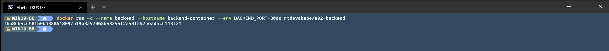
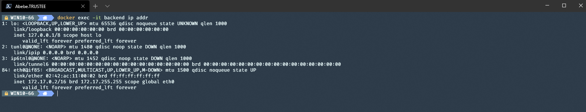
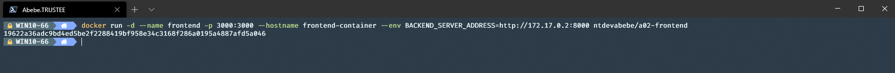
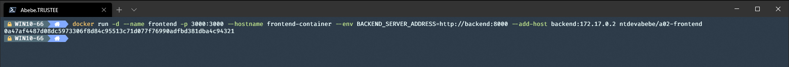

# A02 - Multiple Containers

The goal of this assignment is to get familiar with basic container management i docker.  
At the end you will deploy, access and analyse interactions between multiple containers running in the same cluster

_Use these images for this assignment_  
Frontend: __ntdevabebe/a02-frontend__  
Backend: __ntdevabebe/a02-backend__

1. Deploy the backend server. Add at least the below flags to docker run command.

* --env BACKEND_PORT=\<any port\> to define witch internal port the backend-server listens on.  

<details>
    <summary> Proposed solution </summary>

```powershell
docker run -d --name <container name> --hostname <hostname> --env <enviromental variabel> <image name>
```



</details>

2. Find ip address of the backend server

<details>
    <summary> Proposed solution </summary>

```powershell
docker exec -it <container name> ip add
```



Alternative 1 - Inspect the container

```powershell
docker inspect <container name>
```

```powershell
[
    {
        ...
        "Networks": {
            "bridge": {  # network name
                ...
                "IPAddress": "172.17.0.2",
                ...
            }
            ...
        }
        ...
    }
]
```

Alternative 2 - Inspect network

```powershell
docker netwokrk inspect <network>  # default network is "bridge"
```

```powershell
[
    {
        "Name": "bridge"
        ...
        "Containers": {
            "<Container ID>": {
                "Name": "backend", # container name
                ...
                "IPAddress": "172.17.0.2",
                ...
            }
            ...
        }
        ...
    }
]
```

</details>

3. Deploy frontend server. Add at least the below flags

* -p \<available port\>:3000 to expose the container to the host network.
* --env BACKEND_SERVER_ADDRESS=<path> to define path to the backend in the from  "http://\<ip-address\>:\<port\>".  
* (Bonus) use --add-host \<hostname\>:\<ip-address\> to add a hostname entry in the container and use hostname instead of ipaddress to define path to backend

<details>
    <summary> Proposed solution </summary>

```powershell
docker run -d --name <container name> --hostname <hostname> --env <enviromental variabel> <image name>
```



<details>
    <summary> Proposed solution for bonus </summary>

```powershell
docker run -d --name <container name> --hostname <hostname> --env <enviromental variabel> --add-host <hostname>:<ip-address> <image name>
```



</details>
</details>

4. Verify that the backend and frontend servers are running.

<details>
    <summary> Proposed solution</summary>

```powershell
docker ps
```


</details>

5. Browse http://localhost:\<port of backend\> and http://\<ip address of backend\>:\<port of backend\>. Do you get any response?

<details>
    <summary> Proposed solution</summary>

    The container does not expose any port outside the cluster and thus is unreachable from host. 

</details>

6. Browse http://localhost:\<port of frontend\>. Do you get any response? Where is the response coming from?

<details>
    <summary> Proposed solution</summary>

    The frontend-container expose port 3000 outside the cluster and thus is reachable from host.  
    Since containers can communicate with eachother as long as they are on the same network,  
    the response message is actually from the backend server routed trough the frontend server. 

</details>

(Bonus below)  

7. Deploy another fronend container but this time add --env PORT=\<a port other than 3000\> and -p \<available port\>:3000.

* When browsing http://localhost:\<port of frontend\> do you get any response?
* Use the command below to determine the correct port you need to change 3000 with to make it work.
  
```powershell
docker logs \<container name\>
```
