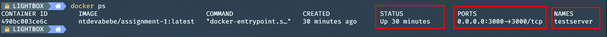
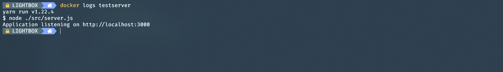
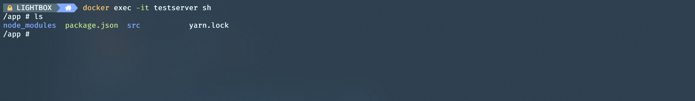

# A02 - Single Container

The goal of this assignment is to get familiar with basic container management i docker.  
At the end you will deploy, access and analyse a simple application in a running container.

1. Verify which containers are running to avoid colliding port or container name assignment

```powershell
docker ps
```

2. deploy the container

```powershell
docker run -d --name <container name> `
--hostname <hostname> `
-p <available ip port>:3000 `
ntdevabebe/assignment-1:latest
```

> | Flag       | description                                                  |
> | :--------- | :----------------------------------------------------------- |
> | -d         | run in detached mode. Alternative "-it" interactive tty mode |
> | -p         | bind external port to container port                         |
> | --name     | name to referance the container in docker commands           |
> | --hostname | The containers hostname to be assigned                       |

3. Verify that the container is running and the ports are binded correctly

<details>
    <summary> Proposed solution </summary>

```powershell
docker ps
```

|                          |
| :------------------------------------------------------------------: |
| "docker ps" returns a list with basic info of all running containers |

</details>

4. Navigate to [http://localhost:3000>](http://localhost:3000) to se the running application

5. Find the ipaddress of the container

<details>
    <summary> Proposed solution </summary>

Alternative 1 - Inspect the container

```powershell
docker inspect <container name>
```

```powershell
[
    {
        ...
        "Networks": {
            "bridge": {
                ...
                "IPAddress": "172.17.0.2",
                ...
            }
            ...
        }
        ...
    }
]
```

Alternative 2 - Inspect network

```powershell
docker netwokrk inspect <network>  # default network is "bridge"
```

```powershell
[
    {
        "Name": "bridge"
        ...
        "Containers": {
            "<Container ID>": {
                "Name": "testserver", # container name
                ...
                "IPAddress": "172.17.0.2",
                ...
            }
            ...
        }
        ...
    }
]
```

</details>
   
6. Attach to logs of the container

<details>
    <summary> Proposed solution </summary>

```powershell
docker logs <container name>
```

> Use the -f flag to attach and follow the output stream of the container
> 

</details>

7. Attach to the running container

<details>
    <summary> Proposed solution </summary>

```powershell
docker exec -it <container name> sh #attach a sh shell to container as root - OBS!! you are now entering linux world
```



</details>

8. [Bonus challenge] Change the output message and verify the change. _(Hint: use vim to edit text)_
