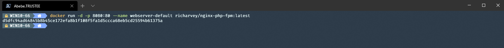
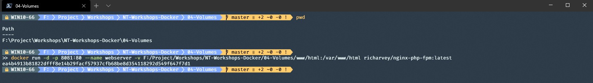

#  A04 - Mounting volumes

The goal of this assignment is to get familiar with basic container management i docker.  
At the end you will deploy, access and analyse interactions between multiple containers running in the same cluster

Webserver image: __richarvey/nginx-php-fpm:latest__  

1. Deploy a container named wbserver-default and bind it to port 8080 on host.

<details>
    <summary> Proposed solution for bonus </summary>

```powershell
docker run -d -p <external port>:<internal port> --name <container name> <image name>
```



</details>

2. Browse htto://localhost:8080. What do you see?

<details>
    <summary> Proposed solution for bonus </summary>

    The webserver is serving the default php welcome page

</details>

3. Deploy another container
    * named webserver1
    * bind it to port 8081 on host
    * bind the folder .\www\html (use absolute path) in this folder to /var/www/html inside the container.  
    (Hint! Use the "pwd" command to get the absolute path to the folder and add filename to it )

<details>
    <summary> Proposed solution for bonus </summary>

```powershell
docker run -d -p <external port>:<internal port> --name <container name> -v <path to folder/file on host>:<path in container> <image name>
```



</details>

4. Browse http://localhost:8081. What do you see?

<details>
    <summary> Proposed solution for bonus </summary>

    You should see a simple html page with the text "Hello Trustee!!"

</details>

5. Run the below commands 

Shows the content of /var/www/html folder inside webserver1 container
```powershell 
docker exec -it webserber1 ls -la /var/www/html  
```

 Showes the content if index.html file in webserver1
```powershell
docker exec -it webserber1 cat /var/www/html/index.html  
```

6. Make an alteration in index.html in ./www/html folder on host, save and run the last command again.  
   What happened to the index.html file inside the container? Reload browser.

7. Deploy a third container 
    * named webserver2
    * bind it to port 8082 on host
    * bind the folder .\www\html (use absolute path) in this folder to /var/www/html inside the container.
  
8. Browse http://localhost:8082. What do you see?
   
9.  Make another alteration to the index.html file on host and browse both port 8081 and port 8082. What do you see?
    